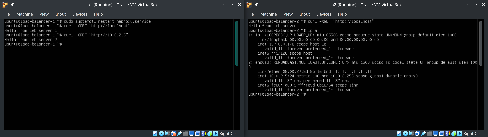

# Introduction
In this post, we will set up load balancers in High Availability mode. We will be setting up the load balancers in an active-passive fail-over configuration.

I will be using HAProxy as the load balancer and Apache web server, but you can try with Nginx as well.

To set up an active-passive configuration we need some process that periodically checks the active load balancer and as soon as it goes down, it should promote the passive one to be active. 
For this, we will be using [keepalived](https://www.keepalived.org/).

# Prerequisites
To proceed, we need 4 machines. All 4 machines should be on the same network and should have internet access to install the required packages. 
Out of these 4 machines, 2 are for load balancers(active and passive) and 2 will be our web servers.

For this, I will be using virtual machines connected via a virtual box NAT network. If you already have machines in hand, please skip to the [Web server setup](#web-server-setup) section. 


## Virtualbox VM setup

### Step 1

Go to Network Manager


### Step 2

Create a new NAT network


### Step 3

Create a new VM.
I will be using Ubuntu server. I just grabbed the VM from https://www.linuxvmimages.com/images/ubuntuserver-2204/


### Step 4
Clone the VM to have a total of 4 VMs.

### Step 5

Set NAT network on the 4 VMs


### Step 6
Boot into the nodes, edit hostnames and note the IP addresses.  
I have named the load balancer nodes as load-balancer-1 & load-balancer-2 and the web server nodes as web-server-1 & web-server-2.

> Note: If cloning the VMs you might see the same IP addressess being assigned to all the clones. This is because of `/etc/machine-id` file present on the nodes. To solve this problem you can delete the file `rm -f /etc/machine-id` and recreate it `dbus-uuidgen --ensure=/etc/machine-id`.  
If `/var/lib/dbus/machine-id` also exists as regular file, remove it as well `rm /var/lib/dbus/machine-id` and recreate it `dbus-uuidgen --ensure`. This last command implicitly uses `/var/lib/dbus/machine-id` as the file name and will copy the machine ID from the already-newly-generated `/etc/machine-id` \[[4]\].

Finally, you will have 4 different machines in the same network with different IPs




# Web server setup
On both web servers install Apache2.
```shell
sudo apt update && sudo apt install -y apache2
```

Next, we configure the web server
```shell
echo "Hello from web server 1" > /var/www/html/index.html
```

Start and enable the web server
```shell
sudo systemctl enable --now apache2
```


# Load balancer setup

## Install and set up HAProxy
1. On both load balancer nodes install HAProxy.

```shell
sudo apt update && sudo apt install -y haproxy
```

2. Next, we need to add frontend and backend configs to HAProxy.  
Edit the config file at `/etc/haproxy/haproxy.cfg` appending in the following:-
```c
frontend mysite
    bind *:80
    option tcplog
    mode tcp
    default_backend web-servers
backend web-servers
    mode tcp
    balance roundrobin
    option tcp-check
    server web1 10.0.2.6:80 check fall 3 rise 2
    server web2 10.0.2.7:80 check fall 3 rise 2
```
The HAProxy config on both LB nodes should look like below after you are done.


The `fall` parameter sets how many failed checks are allowed.
The `rise` parameter sets how many passing checks there must be before returning a previously failed server to the rotation.
Refer \[[5]\] for more health check options.

3. Restart and enable the HAProxy service
```shell
sudo systemctl restart haproxy
sudo systemctl enable haproxy
```

Right now if we were to visit any of the addresses below on any of these 4 nodes(or any other node in the same network), we should get our HTML page back.
```shell
 curl http://10.0.2.4 # load-balancer-1
 curl http://10.0.2.5 # load-balancer-2
 curl http://10.0.2.6 # web-server-1
 curl http://10.0.2.7 # web-server-2
```



Next, we need to enable failover, i.e., in case one of the load balancers goes down, the web page should still be reachable.

For this, we will need some process to monitor HAProxy on the LB nodes and somehow route the requests via the load balancer which is alive. This can be done using [Virtual Router Redundancy Protocol(VRRP)](https://en.wikipedia.org/wiki/Virtual_Router_Redundancy_Protocol).


## Install and setup keepalived

We will use Keepalived, which is a software implementation of VRRP on Linux.

Before setting up keepalived let's understand the request flow.


VRRP uses a virtual IP address (VIP) \[[6]\]. A set of routers participate in an election to determine the host that will control that VIP. Only one router (the master) controls the VIP at a time. If the master fails, VRRP provides mechanisms for detecting that failure and quickly failing over to a standby router. 
The same algorithm can be used for servers as well. 

In the above topology, lb1 is the master and is responsible for the `10.0.2.100` IP address. If lb1 fails, then lb2 takes over this IP. This is why it is also called floating IP.


On both LB nodes install keepalived
```shell
sudo apt update && sudo apt install -y keepalived
```

Next, we need to configure keepalived.
As mentioned before, keepalived needs to monitor HAProxy service running on the node, and as soon as it finds HAProxy is down on the node, it needs to switch the active and the passive LB nodes by moving the virtual IP from MASTER to the BACKUP node.

To check whether LB went down we can check for the status of HAProxy. For this, we can use the `kill` command with the `-0` flag. \[[1]\]

```shell
man kill  
...
DESCRIPTION
    ...
       If signal is 0, then no actual signal is sent, but error checking is still performed.
```
We can use this to check whether our load balancer is down.


Next, we configure keepalived by creating `/etc/keepalived/keepalived.conf` with the following content on the active load balancer.

```conf
# Following script will be used to check if HAProxy is still running
vrrp_script chk_haproxy {
    script "killall -0 haproxy"
    interval 2              # script check frequency
    weight 2                # step size for priority increase/decrease
}

# Create a virtual interface
vrrp_instance vif1 {
    interface enp0s3        # the physical interface to attach to
                            # get correct adapter name using ip addr/ifconfig command on your LB nodes. 
    state MASTER            # we will set this to BACKUP on the other machine
    priority 101            # we will set this to 100 on the other machine

    virtual_router_id 51    # needs to be the same on MASTER and BACKUP 

    # The virtual ip address shared between the two loadbalancers
    virtual_ipaddress {
        10.0.2.100
    }

    # Use the script above to check if we should fail over
    track_script {
        chk_haproxy
    }
}
```

On the passive load-balancer create the file `/etc/keepalived/keepalived.conf` with the following content:-

```conf
# Following script will be used to check if HAProxy is still running
vrrp_script chk_haproxy {
    script "killall -0 haproxy"
    interval 2
    weight 2    
}

# Create a virtual interface with same virtual_router_id as MASTER
vrrp_instance vif1 {
    interface enp0s3
    state BACKUP               
    priority 100               
    virtual_router_id 51       
    
    # The virtual ip address shared between the two loadbalancers
    virtual_ipaddress {
        10.0.2.100
    }
    
    # Use the script above to check if we should fail over
    track_script {
        chk_haproxy
    }
}
```

Now if you check the `enp0s3` interface on the master LB node, you will see the floating IP is also assigned to the same interface. 


# Testing
Now from one of the webserver nodes try to `curl http://10.0.2.100`, and you should get the web page.  

Next, stop the HAProxy running on master LB, by either stopping the service `sudo systemctl stop HAProxy` or even powering off the node, while trying to get the web page `curl http://10.0.2.100` and you will notice that the webpage becomes unavailable intermittently but then becomes available again. This is because the BACKUP HAProxy gets promoted to MASTER.
You can see the floating IP now shows up on the backup load-balancer node.
You can even try watching the keepalived service logs on load-balancer-2 for when it gets promoted from BACKUP to MASTER using `journalctl -fu keepalived.service`

# Next steps
Try setting up the two load balancers in active-active mode.

<!-- ## References -->
[1]: https://serverfault.com/questions/436732/meaning-of-killall-0 "Meaning of killall -0"

[2]: https://www.linuxvmimages.com/images/ubuntuserver-2204/ "Ubuntu server 22.04 VM image"

[3]: https://www.learnitguide.net/2021/11/configure-ha-cluster-using-keepalived.html "keepalived"

[4]: https://unix.stackexchange.com/a/403054 "machine-id"
[5]: https://www.HAProxy.com/blog/how-to-enable-health-checks-in-HAProxy "How to Enable Health Checks in HAProxy"
[6]: https://www.redhat.com/sysadmin/ha-cluster-linux "VRRP"